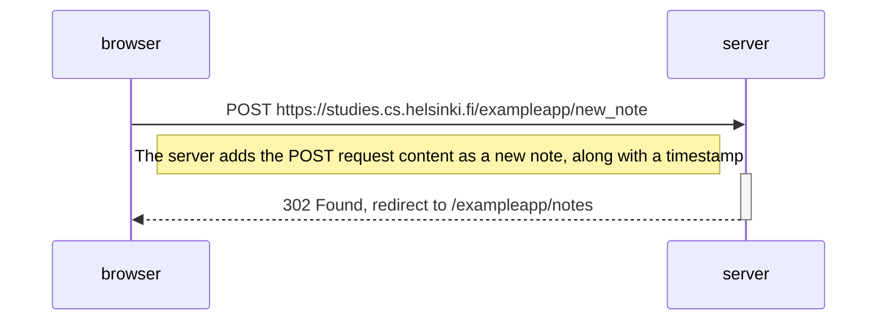

```mermaid
sequenceDiagram
    participant browser
    participant server

    browser->>server: POST https://studies.cs.helsinki.fi/exampleapp/new_note
    Note right of browser: The server adds the POST request content as a new note, along with a timestamp

    activate server
    server-->>browser: 302 Found, redirect to /exampleapp/notes
    deactivate server
```
