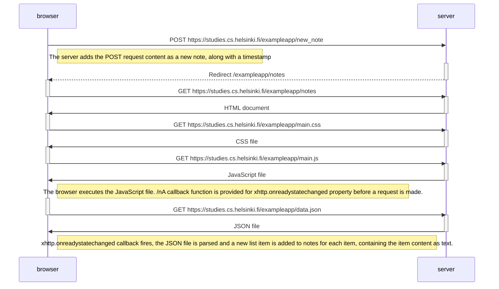

```mermaid
sequenceDiagram
    participant browser
    participant server

    browser->>server: POST https://studies.cs.helsinki.fi/exampleapp/new_note
    Note right of browser: The server adds the POST request content as a new note, along with a timestamp

    activate server
    server-->>browser: Redirect /exampleapp/notes
    deactivate server

    activate browser
    browser->>server: GET https://studies.cs.helsinki.fi/exampleapp/notes
    deactivate browser

    activate server
    server->>browser: HTML document
    deactivate server

    activate browser
    browser->>server: GET https://studies.cs.helsinki.fi/exampleapp/main.css
    deactivate browser

    activate server
    server->>browser: CSS file
    deactivate server

    activate browser
    browser->>server: GET https://studies.cs.helsinki.fi/exampleapp/main.js
    deactivate browser

    activate server
    server->>browser: JavaScript file
    deactivate server

    Note right of browser: The browser executes the JavaScript file. /nA callback function is provided for xhttp.onreadystatechanged property before a request is made.

    activate browser
    browser->>server: GET https://studies.cs.helsinki.fi/exampleapp/data.json
    deactivate browser

    activate server
    server->>browser: JSON file
    deactivate server

    Note right of browser: xhttp.onreadystatechanged callback fires, the JSON file is parsed and a new list item is added to notes for each item, containing the item content as text.
```
