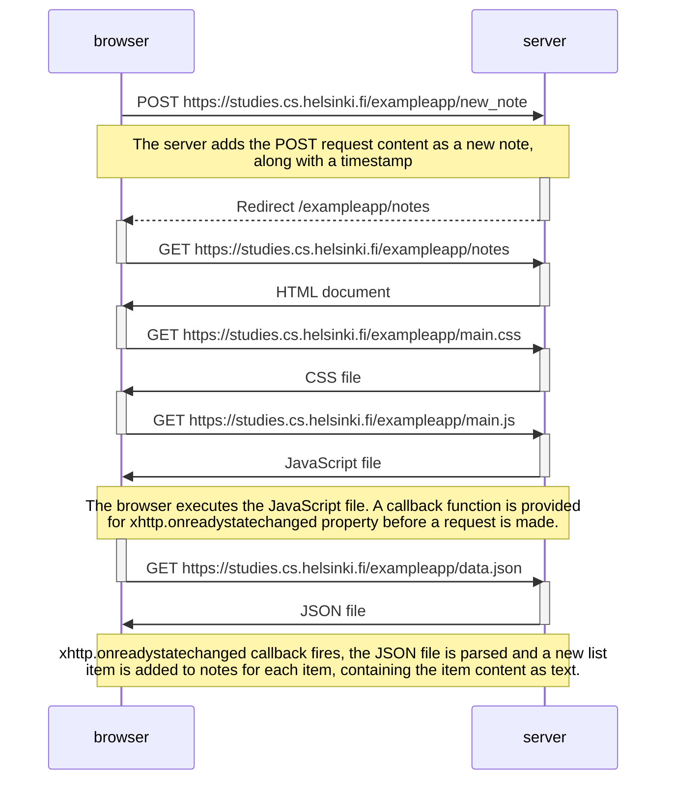
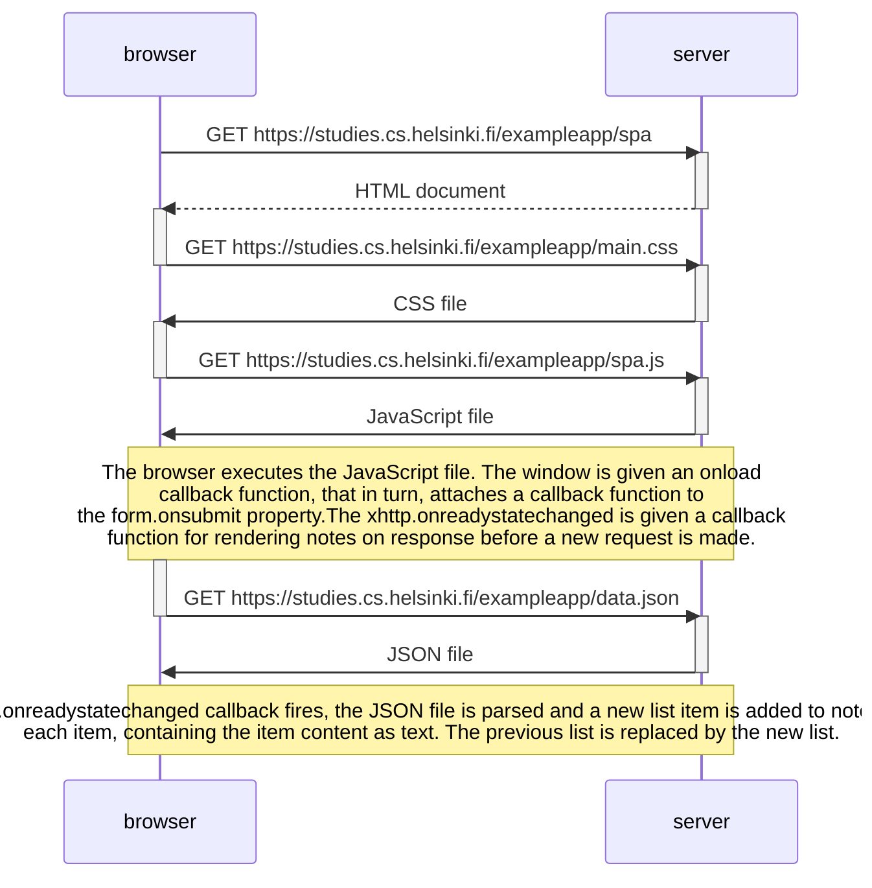

# 0.4 uusi muistiinpano

```mermaid
sequenceDiagram
    participant browser
    participant server

    browser->>server: POST https://studies.cs.helsinki.fi/exampleapp/new_note
    Note over browser,server: The server adds the POST request content as a new note,<br/>along with a timestamp

    activate server
    server-->>browser: Redirect /exampleapp/notes
    deactivate server

    activate browser
    browser->>server: GET https://studies.cs.helsinki.fi/exampleapp/notes
    deactivate browser

    activate server
    server->>browser: HTML document
    deactivate server

    activate browser
    browser->>server: GET https://studies.cs.helsinki.fi/exampleapp/main.css
    deactivate browser

    activate server
    server->>browser: CSS file
    deactivate server

    activate browser
    browser->>server: GET https://studies.cs.helsinki.fi/exampleapp/main.js
    deactivate browser

    activate server
    server->>browser: JavaScript file
    deactivate server

    Note over browser,server: The browser executes the JavaScript file. A callback function is provided<br/>for xhttp.onreadystatechanged property before a request is made.

    activate browser
    browser->>server: GET https://studies.cs.helsinki.fi/exampleapp/data.json
    deactivate browser

    activate server
    server->>browser: JSON file
    deactivate server

    Note over browser,server: xhttp.onreadystatechanged callback fires, the JSON file is parsed and a new list<br/>item is added to notes for each item, containing the item content as text.
```
# 0.5 Single Page App

```mermaid
sequenceDiagram
    participant browser
    participant server

    browser->>server: GET https://studies.cs.helsinki.fi/exampleapp/spa

    activate server
    server-->>browser: HTML document
    deactivate server

    activate browser
    browser->>server: GET https://studies.cs.helsinki.fi/exampleapp/main.css
    deactivate browser

    activate server
    server->>browser: CSS file
    deactivate server

    activate browser
    browser->>server: GET https://studies.cs.helsinki.fi/exampleapp/spa.js
    deactivate browser

    activate server
    server->>browser: JavaScript file
    deactivate server

    Note over browser,server: The browser executes the JavaScript file. The window is given an onload<br/>callback function, that in turn, attaches a callback function to<br/> the form.onsubmit property.The xhttp.onreadystatechanged is given a callback<br/>function for rendering notes on response before a new request is made.

    activate browser
    browser->>server: GET https://studies.cs.helsinki.fi/exampleapp/data.json
    deactivate browser

    activate server
    server->>browser: JSON file
    deactivate server

    Note over browser,server: xhttp.onreadystatechanged callback fires, the JSON file is parsed and a new list item is added to notes for<br/>each item, containing the item content as text. The previous list is replaced by the new list.
```
